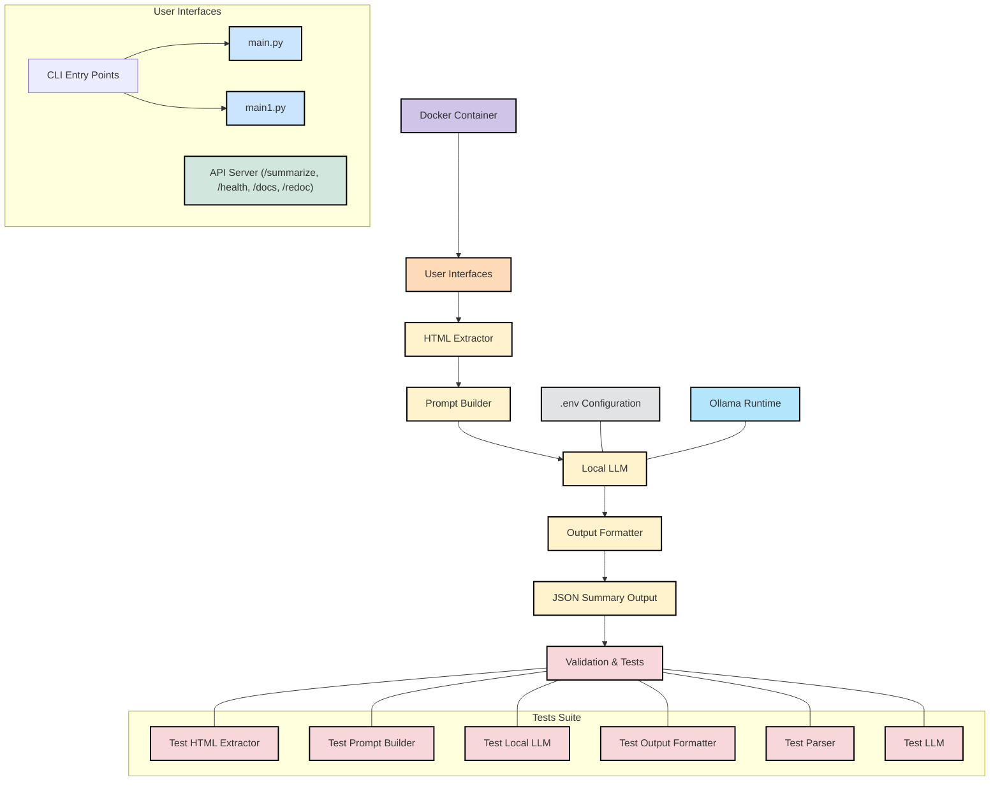

# Transcription Summarizer

A Python-based system for summarizing HTML transcription content using local LLM inference.

[The Doc of implementation](https://hackmd.io/@jeff14994/rk3MDi3Cye)

## Features

- Fetches and parses HTML transcription content from SayIt archive
- Uses Ollama with Breeze/Qwen models for local inference
- Generates structured JSON summaries
- Dockerized for easy deployment
- **REST API server for backend integration**

## System Design of the ML System

## Prerequisites

- Python 3.9+
- Docker (optional)
- Ollama runtime installed locally

## Installation

1. Clone the repository:
```bash
git clone https://github.com/jeff14994/summary-LLM/blob/main/README.md
cd summarizer_project
```

2. Install dependencies:
```bash
pip install -r requirements.txt
```

3. Install Ollama (if not already installed):
```bash
curl -fsSL https://ollama.com/install.sh | sh
```

4. Pull the required LLM model:
```bash
ollama pull jcai/breeze-7b-32k-instruct-v1_0:q4_0
```

## Usage

### Command Line Interface

1. Run the summarizer:
```bash
python3 main.py --url "https://sayit.archive.tw/2025-02-02-bbc-採訪" --verbose
```

2. For Docker usage:
```bash
docker build -t summarizer .
docker run summarizer --url "https://sayit.archive.tw/2025-02-02-bbc-採訪"
```

### API Server

1. Start the API server:
```bash
python3 api_server.py
```

2. The server will be available at `http://localhost:8000`

3. Make API requests:
```bash
curl -X POST "http://localhost:8000/summarize" \
     -H "Content-Type: application/json" \
     -d '{"url": "https://sayit.archive.tw/2025-02-02-bbc-採訪", "verbose": true}'
```

4. API Documentation:
   - Swagger UI: `http://localhost:8000/docs`
   - ReDoc: `http://localhost:8000/redoc`

5. Health Check:
```bash
curl "http://localhost:8000/health"
```

## Project Structure

```
summarizer_project/
├── README.md
├── requirements.txt
├── Dockerfile
├── main.py
├── api_server.py
├── summarizer/
│   ├── __init__.py
│   ├── html_extractor.py
│   ├── prompt_builder.py
│   ├── local_llm.py
│   └── output_formatter.py
└── tests/
    └── test_html_extractor.py   
    └── test_local_llm.py        
    └── test_parser.py
    └── test_llm.py              
    └── test_output_formatter.py 
    └── test_prompt_builder.py
```

## Configuration

Create a `.env` file in the project root with the following variables:
```
OLLAMA_MODEL=jcai/breeze-7b-32k-instruct-v1_0:q4_0
OUTPUT_DIR=./output
OLLAMA_TIMEOUT=30
OLLAMA_NUM_CTX=1024
OLLAMA_NUM_THREAD=8
MAX_CHUNK_SIZE=500
CHUNK_OVERLAP=100
MAX_WORKERS=4
```

## License

MIT License 
