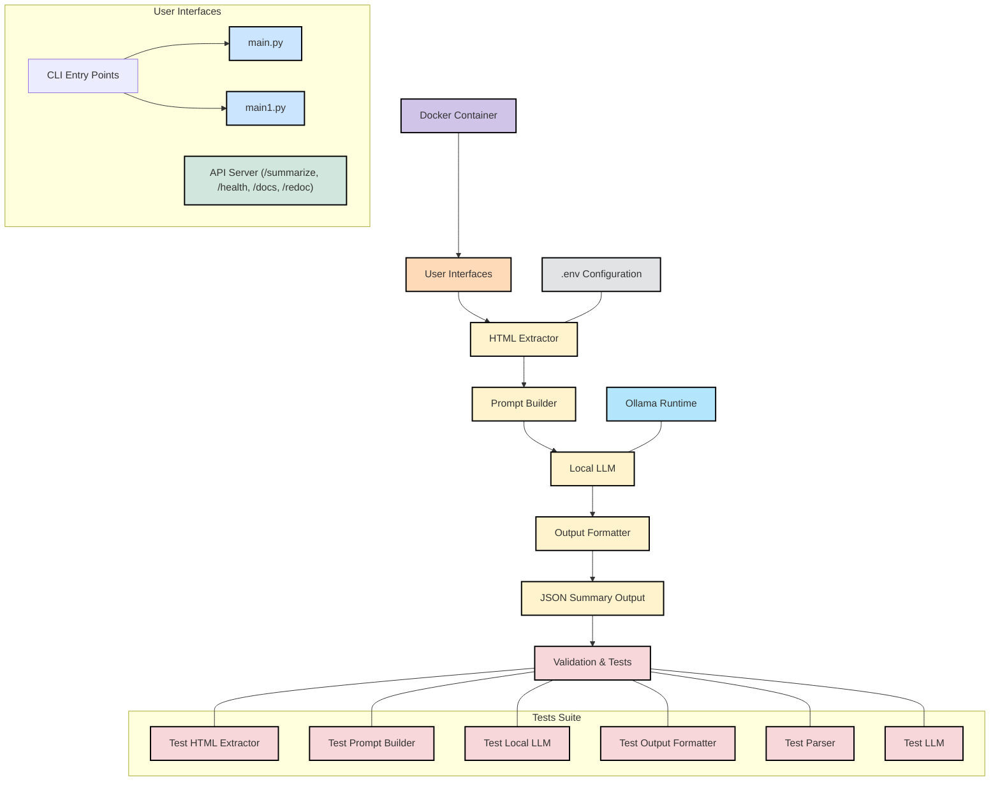

# Summarize Transcription with Ollama

:::info
面試職位： Software Engineer, Backend, LLM Product
面試者：洪裕權
:::

## Main Goal
A Python-based system for summarizing HTML transcription content using local LLM inference.

- Here is the [GitHub Repo](https://github.com/jeff14994/summary-LLM)
- Please read the [README.md](https://github.com/jeff14994/summary-LLM/blob/main/README.md) to reproduce the result.
- Please read REPORT.md for the implmentation result.
- Please read REPORT.pdf for better output.


## System Design of the ML System
The following figure describes how the ML System works. There are 4 main components which is HTML Extractor, Prompt Builder, Local LLM, Output Formatter. You can run the system by using either `main.py` or `api_server.py` as the source code, or run with `docker`. (Please read `README.md` for more info)



## File Directory
The following is the file directory.
```python=
summarizer_project/
├── README.md
├── requirements.txt
├── Dockerfile
├── main.py
├── api_server.py
├── summarizer/
│   ├── __init__.py
│   ├── html_extractor.py
│   ├── prompt_builder.py
│   ├── local_llm.py
│   └── output_formatter.py
└── tests/
    └── test_html_extractor.py   
    └── test_local_llm.py        
    └── test_parser.py
    └── test_llm.py              
    └── test_output_formatter.py 
    └── test_prompt_builder.py
```


## Model Speed Tested
- Various models
    - [`jcai/breeze-7b-32k-instruct-v1_0:f16`](https://ollama.com/jcai/breeze-7b-instruct-v1_0:f16)
    - [`jcai/breeze-7b-32k-instruct-v1_0:q4_0`](https://ollama.com/jcai/breeze-7b-instruct-v1_0:q4_0)
    - [`llama3.2:latest`](https://ollama.com/library/llama3.2:latest)
- Use different methods
    - split texts in multiple chunks to improve speed

## Unit Test
I've implement the following scripts to test each component.
```pytohn=
test_html_extractor.py   
test_local_llm.py        
test_output_formatter.py 
test_prompt_builder.py
```

## Run an Api Server as a Backend
```python=
python3 api_server.py
```

## Run as a Container
[Dockerfile](https://github.com/jeff14994/summary-LLM/blob/main/Dockerfile)
The response time varies from 5 mins to 20 mins based on the model you choose. You can choose the model via modifing the `env` file also in Dockerfile.
```python=
# clone the repo
git clone https://github.com/jeff14994/summary-LLM.git
cd summary-LLM

# build container
docker build -t summarizer .
docker run -p 8000:8000 summarizer

# run payload
curl -X POST "http://localhost:8000/summarize" \
     -H "Content-Type: application/json" \
     -d '{"url": "https://sayit.archive.tw/2025-02-02-bbc-採訪", "verbose": true}' | jq
```


## Test with the Payload
### The system I implemented the code
```python=
jeff14994@instance-20250414-150054:~$ uname -a
Linux instance-20250414-150054 5.15.0-1078-gcp #87~20.04.1-Ubuntu SMP Mon Feb 24 10:23:16 UTC 2025 x86_64 x86_64 x86_64 GNU/Linux

jeff14994@instance-20250414-150054:~$ lsb_release -a
No LSB modules are available.
Distributor ID: Ubuntu
Description:    Ubuntu 20.04.6 LTS
Release:        20.04
Codename:       focal
```

### Test 1
It took around 11 mins 58 secs to process the whole data with 
- [the payload](https://sayit.archive.tw/2025-02-02-bbc-採訪)
- the model I used: `jcai/breeze-7b-32k-instruct-v1_0:f16`
- the following is the result
    - 

### Test 2

It took 5 mins 44 secs to process the whole data with 
- [the payload](https://sayit.archive.tw/2025-02-02-bbc-採訪)
- the model I used: `jcai/breeze-7b-32k-instruct-v1_0:q4_0`
- the following is the result
    - 

### Test 3

It took 3 mins 53 secs to process the whole data with 
- [the payload](https://sayit.archive.tw/2025-03-27-%E5%95%86%E5%91%A8%E5%B0%88%E6%AC%84%E7%94%A8-ai-%E8%AE%93%E7%A4%BE%E6%9C%83%E5%9C%98%E7%B5%90)
- the model I used: `llama3.2:latest`

### THe following is the result
```bash=
curl -X POST "http://localhost:8000/summarize"\n
-H "Content-Type: application/json"\n
-d '{"url": "https://sayit.archive.tw/2025-03-27-%E5%95%86%E5%91%A8%E5%B0%88%E6%AC%84%E7%94%A8-ai-%E8%AE%93%E7%A4%BE%E6%9C%83%E5%9C%98%E7%B5%90", "verb
ose": true}' | jq
```
`Server logging`

```python=
jeff14994@instance-20250414-150054:~$ python3 ./summary-LLM/api_server.py                                                                                                                     
INFO:     Will watch for changes in these directories: ['/home/jeff14994']                                                                                                                    
INFO:     Uvicorn running on http://0.0.0.0:8000 (Press CTRL+C to quit)                                                                                                                       
INFO:     Started reloader process [90054] using StatReload                                                                                                                                   
INFO:     Started server process [90057]                                                                                                                                                      
INFO:     Waiting for application startup.                                                                                                                                                    
INFO:     Application startup complete.                                                                                                                                                     
2025-04-16 03:40:04.120 | INFO     | api_server:summarize:73 - Received summarization request for URL: https://sayit.archive.tw/2025-03-27-%E5%95%86%E5%91%A8%E5%B0%88%E6%AC%84%E7%94%A8-ai-%E
8%AE%93%E7%A4%BE%E6%9C%83%E5%9C%98%E7%B5%90                                                                                                                                                   
2025-04-16 03:40:04.121 | INFO     | api_server:summarize:77 - Initializing LLM...                                                                                                            
2025-04-16 03:40:04.243 | INFO     | api_server:summarize:83 - Fetching transcription from https://sayit.archive.tw/2025-03-27-%E5%95%86%E5%91%A8%E5%B0%88%E6%AC%84%E7%94%A8-ai-%E8%AE%93%E7%A
4%BE%E6%9C%83%E5%9C%98%E7%B5%90...                                                                                                                                                            
2025-04-16 03:40:04.794 | DEBUG    | api_server:summarize:87 - Extracted transcription: 唐鳳: 俄烏戰爭已超過三年，國際局勢持續動盪。今年以來，臺灣的海纜已經斷了六次，共機侵擾頻率也不斷升高。
唐鳳: 除了國際衝突，天然災害也是不安定因子，今年初，美國加州野火延燒近月，迫使超過二十萬人撤離家園。                                                                                          
唐鳳: 天災人禍降臨時，政府往往得一邊忙救災，一邊安撫不同政治立場、價值觀相左的群眾互相指責，不但難以緩解災害造成的衝擊，社會也更難團結。                                                      
唐鳳: 社會互信一旦下降，重大災害期間，外部勢力要...                                                                                                                                           
2025-04-16 03:40:04.795 | INFO     | api_server:summarize:91 - Building prompt...                                                                                                             
2025-04-16 03:40:04.795 | DEBUG    | api_server:summarize:93 - Built prompt: <|im_start|>system                                                                                               
你是一個專業的會議記錄摘要生成助手。你的任務是根據提供的會議記錄內容，生成結構化的摘要。                                                                                                      
請遵循以下格式生成摘要：                                                                                                                                                                      
1. 摘要要點：列出3-5個最重要的討論點                                                                                                                                                          
2. 結論：簡要總結會議的主要結論                                                                                                                                                               
3. 行動項目：列出需要跟進的具體行動項目                                                                                                                                                       
                                                                                                                                                                                              
請確保摘要：                                                                                                                                                                                  
- 保持客觀中立                                                                                                                                                                                
- 突出關鍵決策和行動項目                                                                                                                                                                      
- 使用清晰簡潔的語言                                                                                                                                                                          
- 保持原始內容的準確性                                                                                                                                                                        
- 輸出為...                                                                                                                                                                                   
2025-04-16 03:40:04.795 | INFO     | api_server:summarize:97 - Generating summary...                                                                                                          
2025-04-16 03:40:04.795 | INFO     | summarizer.local_llm:generate_summary:291 - Generating summary with local LLM...                                                                         
2025-04-16 03:40:04.795 | INFO     | summarizer.local_llm:generate_summary:297 - Output will be saved to: llm_outputs/llm_output_20250416_034004.txt                                          
2025-04-16 03:40:04.796 | INFO     | summarizer.local_llm:generate_summary:301 - Split text into 2 chunks                                                                                     
2025-04-16 03:43:25.814 | INFO     | summarizer.local_llm:generate_summary:325 - Completed chunk 1/2                                                                                          
2025-04-16 03:43:57.551 | INFO     | summarizer.local_llm:generate_summary:325 - Completed chunk 2/2                                                                                          
2025-04-16 03:43:57.553 | INFO     | summarizer.local_llm:generate_summary:336 - Output saved to: llm_outputs/llm_output_20250416_034004.txt                                                  
2025-04-16 03:43:57.553 | DEBUG    | api_server:summarize:101 - Raw summary: I'm ready to help! Based on the provided text, here is a concise summary: 
1. The AI assistant will generate a structured summary of the meeting record.
2. The assistant's task is to summarize based on the content provided.

Please provide the next part of the text for me to process and assist you further.

Here is a summary of the meeting in 3-5 key points:

1. The Russian-Ukrainian conflict has lasted over three years, causing frequent naval disruptions and increased air force incursions in Taiwan.
2. Natural disasters are also a significant factor, with recent wildfires in California forcing over 20,000 people to evacuate, highlighting the need for social cohesion during crisis times.
3. To build social resilience, Taiwan should focus on promoting horizontal trust by fostering open discussion and consensus-building, as evidenced by California's "Engaged California" platfo
rm which utilizes AI to summarize and compare opinions.
4. However, generating forms of artificial intelligence (AI) also poses challenges, such as the risk of fake online identities, which can be mitigated through the use of decentralized identi
ty verification systems like "數位憑證皮夾".
5. Ultimately, social cohesion and trust are crucial for Taiwan to effectively address natural disasters and other crises, requiring active participation from individuals and a culture that 
values diversity and respectful dialogue.
2025-04-16 03:43:57.554 | INFO     | api_server:summarize:105 - Parsing summary...
2025-04-16 03:43:57.554 | DEBUG    | api_server:summarize:107 - Parsed summary: {'summary': ['The AI assistant will generate a structured summary of the meeting record.', "The assistant's ta
sk is to summarize based on the content provided.", 'The Russian-Ukrainian conflict has lasted over three years, causing frequent naval disruptions and increased air force incursions in Taiw
an.', 'Natural disasters are also a significant factor, with recent wildfires in California forcing over 20,000 people to evacuate, highlighting the need for social cohesion during crisis ti
mes.', 'To build social resilience, Taiwan should focus on promoting horizontal trust by fostering open discussion and consensus-building, as evidenced by California\'s "Engaged California" platform which utilizes AI to summarize and compare opinions.', 'However, generating forms of artificial intelligence (AI) also poses challenges, such as the risk of fake online identities, 
which can be mitigated through the use of decentralized identity verification systems like "數位憑證皮夾".', 'Ultimately, social cohesion and trust are crucial for Taiwan to effectively addr
ess natural disasters and other crises, requiring active participation from individuals and a culture that values diversity and respectful dialogue.'], 'conclusion': 'Ultimately, social cohe
sion and trust are crucial for Taiwan to effectively address natural disasters and other crises, requiring active participation from individuals and a culture that values diversity and respectful dialogue.', 'action_items': []}          
2025-04-16 03:43:57.555 | INFO     | api_server:summarize:115 - Saving summary...
2025-04-16 03:43:57.555 | DEBUG    | api_server:summarize:117 - Formatted summary: {'metadata': {'source_url': 'https://sayit.archive.tw/2025-03-27-%E5%95%86%E5%91%A8%E5%B0%88%E6%AC%84%E7%94%A8-ai-%E8%AE%93%E7%A4%BE%E6%9C%83%E5%9C%98%E7%B5%90', 'generated_at': '2025-04-16T03:43:57.555433', 'version': '1.0'}, 'content': {'summary': ['The AI assistant will generate a structured summary of the meeting record.', "The assistant's task is to summarize based on the content provided.", 'The Russian-Ukrainian conflict has lasted over three years, causing frequent naval disruptions and increased air force incursions in Taiwan.', 'Natural disasters are also a significant factor, with recent wildfires in California forcing over 20,000 people to evacuate, highlighting the need for social cohesion during crisis times.', 'To build social resilience, Taiwan should focus on promoting horizontal trust by fostering open discussion and consensus-building, 
as evidenced by California\'s "Engaged California" platform which utilizes AI to summarize and compare opinions.', 'However, generating forms of artificial intelligence (AI) also poses chall
enges, such as the risk of fake online identities, which can be mitigated through the use of decentralized identity verification systems like "數位憑證皮夾".', 'Ultimately, social cohesion and trust are crucial for Taiwan to effectively address natural disasters and other crises, requiring active participation from individuals and a culture that values diversity and respectful dialogue.'], 'conclusion': 'Ultimately, social cohesion and trust are crucial for Taiwan to effectively address natural disasters and other crises, requiring active participation from indivi
duals and a culture that values diversity and respectful dialogue.', 'action_items': []}}
2025-04-16 03:43:57.556 | INFO     | summarizer.output_formatter:save_summary:61 - Summary saved to ./output/summary_20250416_034357.json
2025-04-16 03:43:57.556 | DEBUG    | api_server:summarize:122 - Final summary: {'metadata': {'source_url': 'https://sayit.archive.tw/2025-03-27-%E5%95%86%E5%91%A8%E5%B0%88%E6%AC%84%E7%94%A8-
ai-%E8%AE%93%E7%A4%BE%E6%9C%83%E5%9C%98%E7%B5%90', 'generated_at': '2025-04-16T03:43:57.555433', 'version': '1.0'}, 'content': {'summary': ['The AI assistant will generate a structured summa
ry of the meeting record.', "The assistant's task is to summarize based on the content provided.", 'The Russian-Ukrainian conflict has lasted over three years, causing frequent naval disrupt
ions and increased air force incursions in Taiwan.', 'Natural disasters are also a significant factor, with recent wildfires in California forcing over 20,000 people to evacuate, highlightin
g the need for social cohesion during crisis times.', 'To build social resilience, Taiwan should focus on promoting horizontal trust by fostering open discussion and consensus-building, as e
videnced by California\'s "Engaged California" platform which utilizes AI to summarize and compare opinions.', 'However, generating forms of artificial intelligence (AI) also poses challenge
s, such as the risk of fake online identities, which can be mitigated through the use of decentralized identity verification systems like "數位憑證皮夾".', 'Ultimately, social cohesion and t
rust are crucial for Taiwan to effectively address natural disasters and other crises, requiring active participation from individuals and a culture that values diversity and respectful dial
ogue.'], 'conclusion': 'Ultimately, social cohesion and trust are crucial for Taiwan to effectively address natural disasters and other crises, requiring active participation from individual
s and a culture that values diversity and respectful dialogue.', 'action_items': []}}
INFO:     127.0.0.1:41776 - "POST /summarize HTTP/1.1" 200 OK
```

`Result of the API output`  
```python=
jeff14994@instance-20250414-150054:~$ curl -X POST "http://localhost:8000/summarize"      -H "jeff14994@instance-20250414-150054:~$ curl -X POST "http://localhost:8000/summarize"      -H "Content-Type: application/json"      -d '{"url": "https://sayit.archive.tw/2025-03-27-%E5%95%86%E5%91%A8%E5%B0%88%E6%AC%84%E7%94%A8-ai-%E8%AE%93%E7%A4%BE%E6%9C%83%E5%9C%98%E7%B5%90", "verb
ose": true}' | jq
  % Total    % Received % Xferd  Average Speed   Time    Time     Time  Current
                                 Dload  Upload   Total   Spent    Left  Speed
100  2229  100  2071    0   158      8      0  0:04:18  0:03:53  0:00:25   524
{
  "summary": {
    "metadata": {
      "source_url": "https://sayit.archive.tw/2025-03-27-%E5%95%86%E5%91%A8%E5%B0%88%E6%AC%84%E7%94%A8-ai-%E8%AE%93%E7%A4%BE%E6%9C%83%E5%9C%98%E7%B5%90",
      "generated_at": "2025-04-16T03:43:57.555433",
      "version": "1.0"
    },
    "content": {
      "summary": [
        "The AI assistant will generate a structured summary of the meeting record.",
        "The assistant's task is to summarize based on the content provided.",
        "The Russian-Ukrainian conflict has lasted over three years, causing frequent naval disruptions and increased air force incursions in Taiwan.",
        "Natural disasters are also a significant factor, with recent wildfires in California forcing over 20,000 people to evacuate, highlighting the need for social cohesion during crisis times.",
        "To build social resilience, Taiwan should focus on promoting horizontal trust by fostering open discussion and consensus-building, as evidenced by California's \"Engaged California\" platform which utilizes AI to summarize and compare opinions.",
        "However, generating forms of artificial intelligence (AI) also poses challenges, such as the risk of fake online identities, which can be mitigated through the use of decentralized identity verification systems like \"數位憑證皮夾\".",
        "Ultimately, social cohesion and trust are crucial for Taiwan to effectively address natural disasters and other crises, requiring active participation from individuals and a culture that values diversity and respectful dialogue."
      ],
      "conclusion": "Ultimately, social cohesion and trust are crucial for Taiwan to effectively address natural disasters and other crises, requiring active participation from individuals and a culture that values diversity and respectful dialogue.",
      "action_items": []
    }
  },
  "success": true,
  "message": "Summary generated successfully",
  "output_path": "./output/summary_20250416_034357.json",
  "logs": [
    "LLM initialized successfully",
    "Transcription extracted successfully",
    "Prompt built successfully",
    "Summary generated successfully",
    "Summary parsed and validated successfully",
    "Summary saved to ./output/summary_20250416_034357.json"
  ]
}
```
### Test 4 - Run with docker API

It took 12 mins 12 sec to process the whole data with 
- [the payload](https://sayit.archive.tw/2025-02-02-bbc-採訪)
- the model I used: `jcai/breeze-7b-32k-instruct-v1_0:f16`
- the following is the result


### Comparsion


| Models | jcai/breeze-7b-32k-instruct-v1_0:f16 | jcai/breeze-7b-32k-instruct-v1_0:q4_0|llama3.2:latest|jcai/breeze-7b-32k-instruct-v1_0:f16 with docker |
| -------- | -------- | -------- | -------- | -------- | 
| Parameters     | 7.49 B     | 7.49 B     | 3.21 B | 7.49 B|
|Time Spent|718 s|344 s|233 s|732 s|

## Difficulities
How to improve the speed of the model reference
I've implement the model to detect language but it turns out need to be improve

## Reference
- Official doc
    - https://github.com/ollama/ollama/blob/main/docs/api.md
- Tutorial:
    - https://ywctech.net/ml-ai/ollama-first-try/
- Projects
    - https://www.youtube.com/watch?v=1y2TohQdNbo&t=890s
- **How can I expose Ollama on my network?**
    - https://github.com/ollama/ollama/blob/main/docs/faq.md#how-can-i-expose-ollama-on-my-network
- How to customize the models on llama?
    - https://www.linkedin.com/pulse/how-customize-llms-ollama-sumuditha-lansakara-dq6uc/
- Github page
    - https://github.com/ollama/ollama
